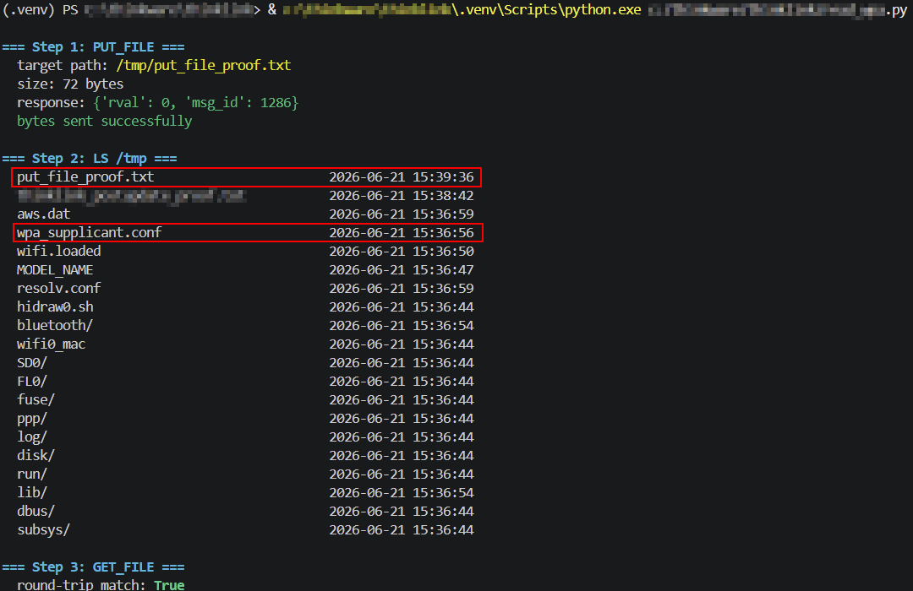

# Thinkware U3000: Arbitrary File Write via Unauthenticated `PUT_FILE`

**Date:** June 2026

**Affected device:** Thinkware U3000 dashcam

**Affected component:** TCP control protocol, command socket port 7878 / data socket port 8787, with no authentication and no TLS

**Firmware tested:** v1.02.04 (current production release). Also separately confirmed on v1.02.00 prior to upgrading. Re-tested specifically after the upgrade to rule out a silent fix; behavior is identical on both.

> **Note on affected model:** all findings below were confirmed against the base Thinkware **U3000**. Thinkware also sells a separate "U3000 Pro" variant; whether it shares the same protocol implementation has not been tested.

## Summary
The U3000's control protocol includes a `PUT_FILE` command (`msg_id` 1286) that writes attacker-supplied bytes to an attacker-supplied absolute path on the device's filesystem. There is no authentication on the socket itself, and no path validation or sandboxing on this command. Confirmed by writing a file directly into the camera's `/tmp` directory, the same directory holding `wpa_supplicant.conf` (WiFi credentials) and at least one shell script (`hidraw0.sh`), and verifying byte-for-byte that it landed exactly where requested.

## Protocol detail

Confirmed directly from the decompiled Android app (`CommandConnector.kt`, `MessageParamKey.kt`).

Request, on the command socket:
```json
{"token": <session token>, "msg_id": 1286, "param": "<absolute path>", "offset": 0, "size": <byte count>, "md5sum": "<hex md5 of payload>"}
```

On `rval >= 0`, the raw file bytes are then written to the **separate data socket** (port 8787), the same channel `GET_FILE` reads from, used in reverse.

## Reproduction steps

1. Complete the standard session handshake: `START_SESSION` -> `SET_CLNT_INFO` -> `APP_CONNECT`.
2. Send `PUT_FILE` with `param` set to a path outside anywhere the official app would legitimately write. Tested path: `/tmp/thinklink_test_proof.txt`.
3. Write the file bytes to the data socket.
4. Camera responds `{"rval": 0, "msg_id": 1286}` immediately, then later pushes an asynchronous `NOTIFICATION` (`msg_id` 7) confirming completion.
5. `LS` on the parent directory confirms the file is present under the exact requested name, alongside system files.
6. `GET_FILE` on the same path reads the content back for a byte-for-byte comparison against what was sent.

## Evidence captured



---

PUT_FILE ack:
```json
{"rval": 0, "msg_id": 1286}
```

Completion notification (arrived asynchronously, independent of normal request/response flow):
```json
{"token": 13, "msg_id": 7, "type": "put_file_complete",
 "param": [{"bytes received": 49}, {"md5sum": "e0276ad936428086d7c17142401ec826"}]}
```

Computed MD5 of the 49-byte test payload sent: `e0276ad936428086d7c17142401ec826`. **Exact match.**

`LS /tmp` after the write:
```
{"put_file_proof.txt":       "2026-06-21 15:39:36"},
{"...":                      "2026-06-21 15:38:42"},
{"aws.dat":                  "2026-06-21 15:36:59"},
{"wpa_supplicant.conf":      "2026-06-21 15:36:56"},
...
```

## Impact

Any device that can reach the camera on its local network (which, absent authentication, includes anyone who joins the camera's WiFi, notably easier given the separately-disclosed plaintext-password finding, or anyone in range if the camera is in AP mode) can write arbitrary content to arbitrary absolute paths on the device's filesystem.